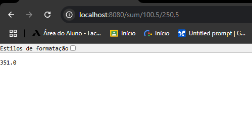
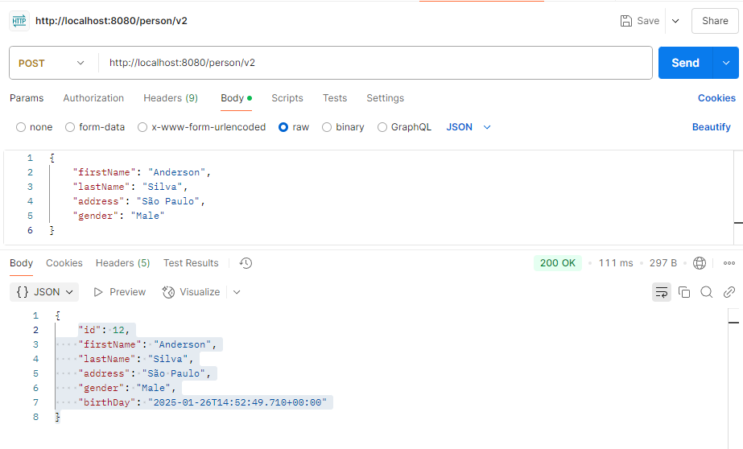
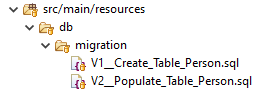
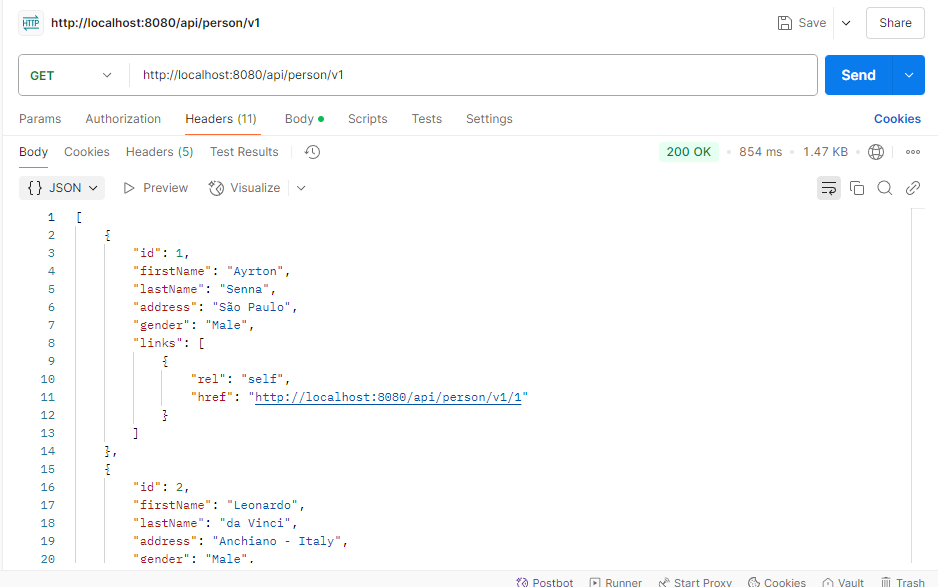
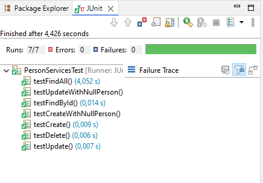
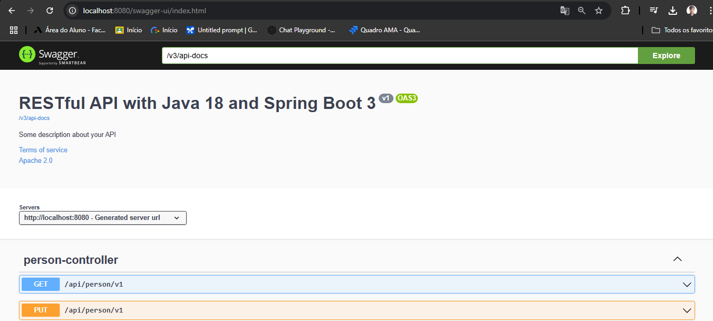

# rest-with-spring-boot-and-java-erudio

# Projeto: Desenvolva uma API REST do Zero e Implante na AWS

Este repositório contém o código desenvolvido durante o curso ["REST API's RESTFul do 0 à AWS c. Spring Boot 3 Java e Docker"](https://www.udemy.com/course/restful-apis-do-0-a-nuvem-com-springboot-e-docker/?kw=spring+aws&src=sac) da Udemy.

O curso aborda a criação de uma API REST do zero, passando por conceitos fundamentais, práticas avançadas e integração com tecnologias modernas para implantação em produção.

# Índice  

- [Tecnologias e Ferramentas Utilizadas](#tecnologias-e-ferramentas-utilizadas)  
- [Módulos Extras](#módulos-extras)  
- [Estrutura do Projeto](#estrutura-do-projeto)  
  - [05_FirstStepsInJavaWithSpringBoot](#05_firststepsinjavawithspringboot)  
  - [07_ApiHttpRequests](#07_apihttprequests)  
  - [11_AddMigrations](#11_addmigrations)  
  - [13_ContentNegotiation](#13_contentnegotiation)  
- [Padrões de Projeto](#padrões-de-projeto)  
- [Pré-requisitos](#pré-requisitos)  

## Tecnologias e Ferramentas Utilizadas

- **Spring Boot 3**
- **Java 21**
- **Arquitetura REST/RESTful**
- **Migrations com Flyway**
- **Postman**
- **Integração com banco de dados MySQL**
- **Content Negotiation**
- **Versionamento de APIs**
- **HATEOAS**
- **Swagger Open API**
- **Autenticação com JWT e Spring Security**
- **Testes unitários e de integração com:**
  - JUnit 5
  - Mockito
  - REST Assured
  - Testcontainers
- **Upload e download de arquivos**

## Módulos Extras

- **[EXTRA 1]** Dockerização da Aplicação
- **[EXTRA 2]** Implantação na Amazon AWS
- **[EXTRA 3]** Integração Contínua na Amazon AWS com o GitHub Actions
- **[EXTRA 4]** Consumo da API com React JS

## Estrutura do Projeto
### [05_FirstStepsInJavaWithSpringBoot](https://github.com/BredexBR/rest-with-spring-boot-and-java-erudio/tree/main/05_FirstStepsInJavaWithSpringBoot/rest-with-spring-boot-and-java-erudio)
- Projeto inicial utilizando os conceitos básicos de REST retornando cálculos como: soma, subtração, multiplicação, divisão e raíz quadrada.
- Utilizando requisições http (Get, Post, Put e Delete).
 

 

### [07_ApiHttpRequests](https://github.com/BredexBR/rest-with-spring-boot-and-java-erudio/tree/main/07_ApiHttpRequests/rest-with-spring-boot-and-java-erudio7)
- Utilizando atributos de pessoas na API.
- Integração ao banco de dados.
- Introduzindo padrão de projeto VO(Value Object).
- Implementação do versionamento para suporte a múltiplas versões da API.
 

 

### [11_AddMigrations](https://github.com/BredexBR/rest-with-spring-boot-and-java-erudio/tree/main/11_AddMigrations/rest-with-spring-boot-and-java-erudio11)
- Utilizando Migrations com Flyway.
- Adicionando Custom Json Serialization, para API retornar seu conteúdo em formato json na ordem e nomenclatura das varáveis desejadas.

 

 

### [13_ContentNegotiation](https://github.com/BredexBR/rest-with-spring-boot-and-java-erudio/tree/main/13_ContentNegotiation/rest-with-spring-boot-and-java-erudio13)
- Adicionando Content Negotiation, para API retornar seu conteúdo em diversos formatos(xml, json, yaml,etc).
- Adicionando HATEOAS (Hypermedia as the Engine of Application State). Basicamente seria incluir links dentro 
das respostas da API para permitir que os clientes naveguem pelos recursos de forma dinâmica.

 

 

- Adicionando testes unitários utilizando mockito e jUnit5 para as funções Create, Update, FindAll e FindById.
 

- **Swagger**.
 

 

- Criando novo endpoint e testes unitários para Books.
- Preparando infraestrutura de testes com Testcontainers

## Padrões de Projeto

O projeto adota os padrões de projeto oferecidos pelo Spring, como Inversão de Controle (IoC) e Injeção de Dependências, além de ter implementado o padrão Value Object (VO) para encapsular valores imutáveis e específicos do domínio.

## Pré-requisitos

1. **Java 21**: Certifique-se de que o Java 21 está instalado na sua máquina.
2. **Docker**: Necessário para a execução de containers. Versão 27.4.0.
3. **MySQL**: Configuração do banco de dados. Versão 8.0.40.
4. **Postman**: Para testar a API.
5. **Java Spring Tool**: Framework na versão 3.3.7.
6. **Mvn**: Gerenciar as dependências e automatizar as builds. Versão 3.3.9.
